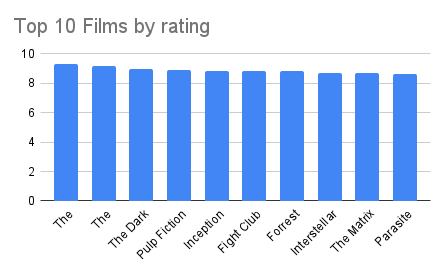
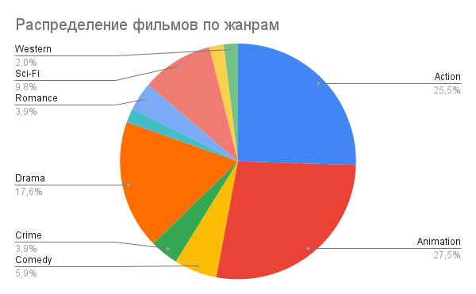
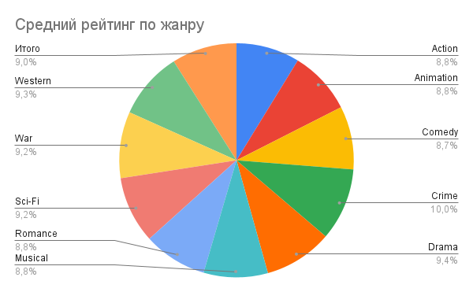
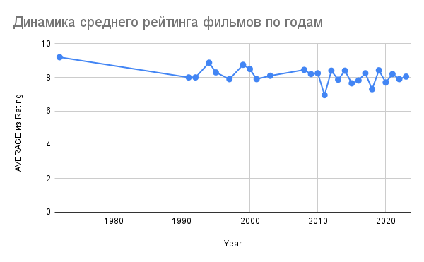

# Анализ факторов популярности фильмов

## 📌 Синопсис
Данный проект посвящён анализу факторов популярности фильмов на основе данных о рейтингах, жанрах, годах выпуска и количестве оценок. Цель исследования — выявить закономерности в оценке фильмов и определить, какие факторы влияют на их успешность.

---

## 🚀 Актуальность
Киноиндустрия является одной из крупнейших сфер развлечений, а понимание предпочтений зрителей имеет большое значение для продюсеров, режиссёров и аналитиков. Анализ данных позволяет выявить, какие жанры и характеристики фильмов наиболее востребованы и высоко оцениваются аудиторией.

---

## ❓ Исследовательские вопросы
- Какие фильмы имеют самые высокие рейтинги?
- Какие жанры являются наиболее популярными?
- Какие жанры получают наивысшие оценки?
- Как меняются рейтинги фильмов со временем?
- Существуют ли закономерности между жанром и качеством фильма?

---

## 📊 Данные
В проекте использован набор данных, содержащий информацию о фильмах:

- Название фильма (Title)
- Год выпуска (Year)
- Жанр (Genre)
- Рейтинг (Rating)
- Количество оценок (Votes)

Данные были предварительно обработаны:
- удалены дубликаты
- приведены к единому формату
- числовые значения нормализованы
- исправлены ошибки форматов

📁 Данные доступны в папке `data/`

---

## 🔍 Анализ

### 1. Топ фильмов по рейтингу
Анализ показал, что наивысшие оценки получают культовые фильмы, среди которых преобладают драмы и криминальные картины. Это свидетельствует о высокой оценке зрителями сложных сюжетов и глубины персонажей.

---

### 2. Распределение фильмов по жанрам
Анализ показал, что наибольшую долю занимают анимация, что говорит об их высокой популярности среди зрителей.

---

### 3. Средний рейтинг по жанрам
Анализ среднего рейтинга по жанрам показал, что наиболее высокие оценки получают драмы и криминальные фильмы. В то же время более развлекательные жанры, такие как комедия и анимация, имеют более низкие средние значения.

---

### 4. Динамика рейтингов по годам
Анализ динамики среднего рейтинга показывает, что оценки фильмов остаются относительно стабильными с течением времени, без резких изменений.

---

## 🧾 Референсы
- Netflix
- IMDb (в качестве ориентировочного источника структуры данных)

---

## 🛠 Инструменты
- Google Таблицы
- GitHub
